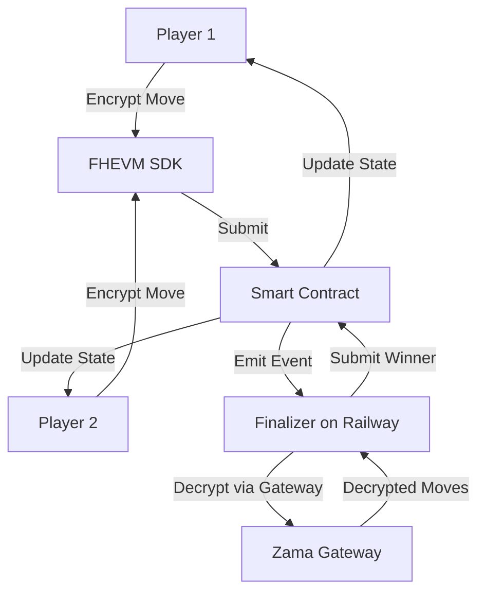

# Rock Paper Scissors with Fully Homomorphic Encryption

## Overview
A decentralized Rock Paper Scissors game using **Zama's FHEVM** for true privacy-preserving gameplay on Sepolia testnet. Players submit encrypted moves that remain private until an off-chain finalizer decrypts them to determine the winner.

## Table of Contents

1. [Features](#features)
2. [Prerequisites](#prerequisites)
3. [Quick Start](#quick-start)
4. [Deployment](#deployment)
5. [Architecture](#architecture)
6. [Troubleshooting](#troubleshooting)

## Features

- **True FHE Encryption**: Uses Zama's FHEVM SDK (`@zama-fhe/relayer-sdk` v0.3.0-6) for real Fully Homomorphic Encryption
- **Web3 Wallet Integration**: WalletConnect support for MetaMask and mobile wallets
- **Private Moves**: Moves encrypted client-side and remain private until finalization
- **Automated Finalization**: Backend service automatically decrypts and finalizes games
- **Modern UI**: React + Tailwind CSS + shadcn/ui

## Prerequisites

- **Node.js**: v18.x or higher
- **pnpm**: `npm install -g pnpm`
- **Git**
- **MetaMask** or WalletConnect-compatible wallet
- **Sepolia ETH** for gas fees

## Quick Start

### 1. Clone and Install

```bash
git clone https://github.com/ismailkonvah/rps.git
cd rps
pnpm install
```

### 2. Configure Frontend

Create `.env` in project root:

```env
VITE_CONTRACT_ADDRESS=0x004510a8a91D7AedAd6eeB58C6D3c40Dc9578667
VITE_RPC_URL=https://eth-sepolia.g.alchemy.com/v2/YOUR_KEY
```

Get a WalletConnect Project ID from [WalletConnect Cloud](https://cloud.walletconnect.com/) and update `src/config/wagmi.js`:

```javascript
const projectId = 'YOUR_PROJECT_ID'
```

### 3. Run Frontend

```bash
pnpm run dev
```

Visit `http://localhost:5173` and connect your wallet.

## Deployment

### Smart Contract (Already Deployed)

Contract Address: `0x004510a8a91D7AedAd6eeB58C6D3c40Dc9578667` (Sepolia)

To deploy your own:

```bash
cd backend
npm install
npx hardhat run scripts/deploy.js --network sepolia
```

### Backend Finalizer (Railway)

The finalizer must run on a platform that supports long-running processes (Railway, Render, Fly.io, etc.).

**Railway Deployment:**

1. Go to [railway.app](https://railway.app) and sign in with GitHub
2. Create New Project → Deploy from GitHub → Select `ismailkonvah/rps`
3. **Settings** → Set Root Directory to `backend`
4. **Variables** → Add:
   ```
   RPC_URL=https://eth-sepolia.g.alchemy.com/v2/YOUR_KEY
   ADMIN_PRIVATE_KEY=0x...
   CONTRACT_ADDRESS=0x004510a8a91D7AedAd6eeB58C6D3c40Dc9578667
   ```
5. Deploy!

The finalizer will automatically:
- Listen for games needing finalization
- Decrypt encrypted moves using FHEVM Gateway
- Compute winner and submit result to contract

## Architecture

### System Flow



### Key Components

**Frontend** (`src/`)
- FHEVM SDK integration for encryption
- WalletConnect + wagmi for wallet connection
- React UI with game state management

**Smart Contract** (`backend/contracts/PrivateRPSFHE.sol`)
- Stores encrypted moves on-chain
- Emits `NeedsOffchainFinalize` when both players submit
- Admin-only `finalizeResult` function

**Finalizer** (`backend/offchain/finalizer.js`)
- Listens for finalization events
- Uses FHEVM Gateway API for decryption
- Automatically submits results

### FHEVM Integration

**SDK Version:** `@zama-fhe/relayer-sdk` v0.3.0-6

**Frontend Encryption:**
```javascript
import { createInstance, SepoliaConfig } from '@zama-fhe/relayer-sdk/web';

const instance = await createInstance(SepoliaConfig);
const input = instance.createEncryptedInput(contractAddress, userAddress);
input.add8(move); // 0=Rock, 1=Paper, 2=Scissors
const encrypted = await input.encrypt();
```

**Backend Decryption:**
```javascript
import { createInstance, SepoliaConfig } from '@zama-fhe/relayer-sdk/node';

const instance = await createInstance(SepoliaConfig);
const { publicKey, privateKey } = instance.generateKeypair();
const eip712 = instance.createEIP712(publicKey, [contractAddress]);
const signature = await signer.signTypedData(...);
const decrypted = await instance.reencrypt(handle, privateKey, publicKey, signature, ...);
```

## Troubleshooting

### Frontend Issues

**"FHEVM not ready yet"**
- Wait a few seconds for FHEVM initialization
- Check browser console for errors
- Ensure you're on Sepolia network

**WalletConnect not working**
- Verify `projectId` in `src/config/wagmi.js`
- Check wallet is on Sepolia network
- Clear browser cache and reconnect

**"Enter game ID" alert**
- Game ID is displayed after creation
- Make sure you created a game first
- Check console logs for `Found GameID: X`

### Backend Issues

**Finalizer not detecting games**
- Check Railway logs for "Listening for events"
- Verify environment variables are set
- Ensure admin wallet has Sepolia ETH

**Decryption failed**
- Check Railway logs for specific error
- Verify SDK version is `0.3.0-6`
- Ensure contract address is correct

**"No decrypt method found"**
- Update to latest SDK version
- Use Gateway `reencrypt` API (not direct `decrypt`)

### Common Errors

| Error | Solution |
|-------|----------|
| `WASM file not found` | Copy `tfhe_bg.wasm` to `public/` folder |
| `initSDK is not a function` | Remove `initSDK()` call in Node.js backend |
| `contractAddresses.every is not a function` | Pass contract address as array: `[CONTRACT_ADDRESS]` |
| `ambiguous primary types` | Remove `EIP712Domain` from types before signing |

## Environment Variables

### Frontend (`.env`)
```env
VITE_CONTRACT_ADDRESS=0x004510a8a91D7AedAd6eeB58C6D3c40Dc9578667
VITE_RPC_URL=https://eth-sepolia.g.alchemy.com/v2/YOUR_KEY
```

### Backend (`backend/.env`)
```env
RPC_URL=https://eth-sepolia.g.alchemy.com/v2/YOUR_KEY
ADMIN_PRIVATE_KEY=0x...  # Admin wallet private key
CONTRACT_ADDRESS=0x004510a8a91D7AedAd6eeB58C6D3c40Dc9578667
```

## Tech Stack

- **Frontend**: React, Vite, Tailwind CSS, shadcn/ui
- **Web3**: wagmi, viem, ethers.js v6, WalletConnect
- **FHE**: Zama FHEVM SDK v0.3.0-6
- **Smart Contract**: Solidity, Hardhat
- **Backend**: Node.js, ethers.js
- **Deployment**: Vercel (frontend), Railway (finalizer)

## Live Demo

**Frontend**: https://rps-ebon-gamma.vercel.app  
**Contract**: [0x004510a8a91D7AedAd6eeB58C6D3c40Dc9578667](https://sepolia.etherscan.io/address/0x004510a8a91D7AedAd6eeB58C6D3c40Dc9578667)

## Future Enhancements

- [ ] Bot player deployment to Railway
- [ ] Tournament mode with multiple rounds
- [ ] Game history and statistics
- [ ] Real-time updates via WebSockets
- [ ] Mainnet deployment
- [ ] Mobile app (React Native)

## License

MIT

## Contributing

Pull requests welcome! Please open an issue first to discuss proposed changes.

## Support

For issues or questions:
- Open a GitHub issue
- Check existing issues for solutions
- Review the troubleshooting section

---

Built with ❤️ using Zama FHEVM
