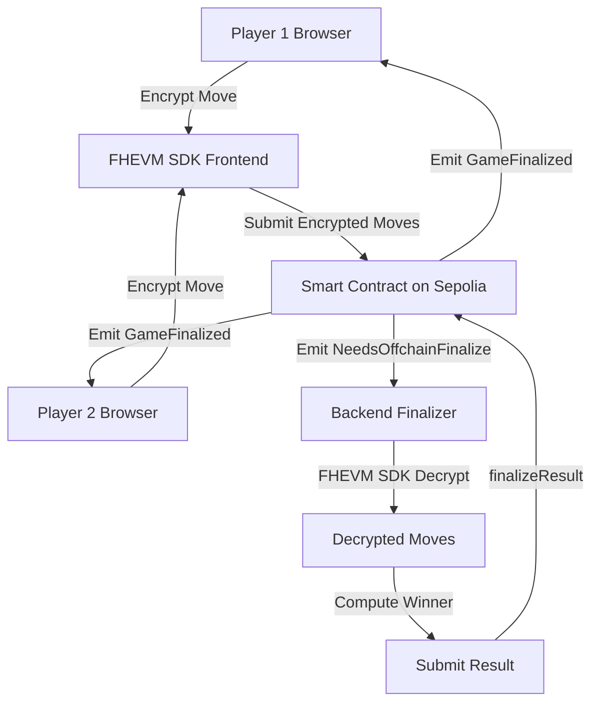

# Private Rock–Paper–Scissors — End-to-End Setup (Sepolia)

## Overview
This project implements a Private Rock Paper Scissors game leveraging Fully Homomorphic Encryption (FHE) concepts for privacy, integrated with Web3 technologies for decentralized gameplay. The frontend is built with React, `wagmi`, and WalletConnect for seamless wallet interactions, while the backend consists of a Solidity smart contract and an off-chain finalizer script.

## Table of Contents

1.  [Project Overview](#1-project-overview)
2.  [Features](#2-features)
3.  [Prerequisites](#3-prerequisites)
4.  [Setup Guide](#4-setup-guide)
    *   [4.1. Clone the Repository](#41-clone-the-repository)
    *   [4.2. Frontend Setup](#42-frontend-setup)
    *   [4.3. Backend Setup (Smart Contract)](#43-backend-setup-smart-contract)
    *   [4.4. Backend Finalizer Setup](#44-backend-finalizer-setup)
5.  [Usage](#5-usage)
    *   [5.1. Running the Frontend](#51-running-the-frontend)
    *   [5.2. Deploying the Smart Contract](#52-deploying-the-smart-contract)
    *   [5.3. Running the Backend Finalizer](#53-running-the-backend-finalizer)
6.  [Contract Details](#6-contract-details)
7.  [FHE (Mocked)](#7-fhe-mocked)
8.  [Troubleshooting](#8-troubleshooting)
9.  [Future Enhancements](#9-future-enhancements)

## 1. Project Overview

This dApp allows two players to play Rock Paper Scissors where their moves are submitted encrypted to a smart contract using **Zama's FHEVM SDK** for real Fully Homomorphic Encryption on Sepolia testnet. An off-chain finalizer decrypts the moves using the FHEVM SDK and determines the winner, updating the game state on the blockchain. The frontend provides a modern UI for interacting with the game.

## 2. Features

*   **Web3 Wallet Integration**: Connects to various wallets via WalletConnect (MetaMask, mobile wallets).
*   **Real FHE Encryption**: Uses Zama's FHEVM SDK (`@zama-fhe/relayer-sdk`) for true Fully Homomorphic Encryption on Sepolia.
*   **Private Moves**: Moves are encrypted client-side and remain private until decrypted by the authorized finalizer.
*   **Smart Contract**: Solidity contract (`PrivateRPSFHE.sol`) manages game state and stores encrypted moves.
*   **Off-chain Finalizer**: Node.js script with FHEVM SDK to decrypt moves and finalize results.
*   **Computer Opponent (Optional)**: Play against an AI opponent if another player is not available.
*   **Modern UI**: Built with React, Tailwind CSS, and `shadcn/ui` for a responsive and intuitive experience.

## 3. Prerequisites

Before you begin, ensure you have the following installed:

*   **Node.js**: v18.x or higher
*   **pnpm**: `npm install -g pnpm`
*   **Git**
*   **MetaMask or a WalletConnect compatible wallet**
*   **Hardhat or Foundry**: For smart contract development and deployment (e.g., `npm install -g hardhat`)

## 4. Setup Guide

### 4.1. Clone the Repository

```bash
git clone <repository-url>
cd private-rps
```

### 4.2. Frontend Setup

1.  **Navigate to the frontend directory**:
    ```bash
    cd private-rps
    ```

2.  **Install dependencies**:
    ```bash
    pnpm install
    ```

3.  **Get a WalletConnect Project ID**: 
    *   Go to [WalletConnect Cloud](https://cloud.walletconnect.com/).
    *   Sign up/log in and create a new project to obtain your `projectId`.

4.  **Configure WalletConnect**: Open `src/config/wagmi.js` and replace `YOUR_PROJECT_ID` with your actual WalletConnect Project ID.

    ```javascript
    // src/config/wagmi.js
    const projectId = 'YOUR_PROJECT_ID' // <--- Update this line
    ```

### 4.3. Backend Setup (Smart Contract)

1.  **Navigate to the backend directory**:
    ```bash
    cd backend
    ```

2.  **Install Hardhat (if not already installed)**:
    ```bash
    npm install -g hardhat
    ```

3.  **Compile the contract**: This will generate the ABI file (`PrivateRPSFHE.json`) in the `artifacts` directory.
    ```bash
    solcjs --abi contracts/PrivateRPSFHE.sol -o artifacts/
    ```

4.  **Deploy the contract**: You will need a Hardhat project setup. Create a deployment script (e.g., `scripts/deploy.js`):
    ```javascript
    // scripts/deploy.js
    const hre = require("hardhat");

    async function main() {
      const [deployer] = await hre.ethers.getSigners();
      console.log("Deploying contracts with the account:", deployer.address);

      const PrivateRPSFHE = await hre.ethers.getContractFactory("PrivateRPSFHE");
      const privateRPSFHE = await PrivateRPSFHE.deploy(deployer.address); // Admin is the deployer

      await privateRPSFHE.waitForDeployment();

      console.log("PrivateRPSFHE deployed to:", privateRPSFHE.target);
    }

    main()
      .then(() => process.exit(0))
      .catch((error) => {
        console.error(error);
        process.exit(1);
      });
    ```
    Run the deployment script on Sepolia:
    ```bash
    npx hardhat run scripts/deploy.js --network sepolia
    ```
    **Note down the deployed contract address.** This will be used for `VITE_CONTRACT_ADDRESS` in the frontend `.env` and `CONTRACT_ADDRESS` in the finalizer `.env`.

### 4.4. Backend Finalizer Setup

1.  **Navigate to the backend directory**:
    ```bash
    cd backend
    ```

2.  **Install dependencies for the finalizer**:
    ```bash
    npm install ethers dotenv
    ```

3.  **Create `.env` file**: In the `backend` directory, create a `.env` file and add the following:
    ```
    RPC_URL="https://sepolia.infura.io/v3/YOUR_INFURA_PROJECT_ID" # Your Sepolia RPC URL
    ADMIN_PRIVATE_KEY="0x..." # Private key of the contract deployer/admin
    CONTRACT_ADDRESS="0x..." # Your deployed contract address
    ZAMA_PUBLIC_KEY="0x..." # Zama FHE public key (hex string, if needed by backend SDK)
    ```
    *   `RPC_URL`: Your Sepolia RPC endpoint.
    *   `ADMIN_PRIVATE_KEY`: **Crucially, use the private key for the account that deployed the contract.** This account will act as the admin and call `finalizeResult` on the contract. **NEVER use a private key from a mainnet account for testing.**
    *   `CONTRACT_ADDRESS`: The address of your deployed `PrivateRPSFHE` contract.
    *   `ZAMA_PUBLIC_KEY`: The public key required by the Zama FHE SDK for decryption/homomorphic operations on the backend.

## Usage

### 1. Running the Frontend

1.  Ensure you are in the project root directory (`private-rps`).
2.  Start the development server:
    ```bash
    pnpm run dev --host
    ```
3.  Open your browser to `http://localhost:5173`.
4.  Connect your wallet (e.g., MetaMask configured for Sepolia).
5.  **Choose Opponent**: Select whether to play against another player or the computer. If playing against the computer, click "Start Game vs Computer". If playing against a player, you can create a game or join an existing one.
6.  Submit your encrypted moves.

### 2. Deploying the Smart Contract

Follow the steps in [Backend Setup (Smart Contract)](#3-backend-setup-smart-contract).

### 3. Running the Backend Finalizer

1.  Ensure the smart contract is deployed and its address and the admin private key are configured in `backend/.env`.
2.  Navigate to the backend directory:
    ```bash
    cd backend
    ```
3.  Run the finalizer script:
    ```bash
    node offchain/finalizer.js
    ```
    This script will start listening for `NeedsOffchainFinalize` events from your deployed contract and automatically finalize games.

## 6. Architecture

### System Architecture



### Key Components

1. **Frontend FHEVM SDK** (`src/fhe/fheSdk.js`)
   - Uses `@zama-fhe/relayer-sdk` with `SepoliaConfig`
   - Encrypts player moves (0=Rock, 1=Paper, 2=Scissors) using `encrypt_uint8`
   - Serializes ciphertext for contract submission
   - Automatically configured for Sepolia testnet

2. **Smart Contract** (`backend/contracts/PrivateRPSFHE.sol`)
   - Stores encrypted moves as `bytes`
   - Emits `NeedsOffchainFinalize` event when both players submit
   - Accepts winner from authorized admin via `finalizeResult`

3. **Backend Finalizer** (`backend/offchain/finalizer.js`)
   - Listens for `NeedsOffchainFinalize` events
   - Uses FHEVM SDK to decrypt both moves
   - Computes winner using RPS logic
   - Submits result back to contract

4. **FHEVM Coprocessor**
   - Zama's infrastructure on Sepolia (configured via `SepoliaConfig`)
   - Handles FHE operations (encryption/decryption)
   - Gateway and KMS automatically configured

### FHEVM Integration

**Frontend:**
- Package: `@zama-fhe/relayer-sdk` v0.2.0
- Configuration: `SepoliaConfig` (automatic setup)
- Functions: `initFHEVM()`, `encryptMove()`, `serializeEncryptedData()`

**Backend:**
- Package: `@zama-fhe/relayer-sdk` v0.2.0
- Configuration: `SepoliaConfig` (automatic setup)
- Functions: `initFHEVM()`, `decryptMove()`

**Environment Variables:**
```env
# Frontend (.env)
VITE_CONTRACT_ADDRESS=<deployed_contract_address>
VITE_RPC_URL=https://eth-sepolia.g.alchemy.com/v2/YOUR_KEY

# Backend (backend/.env)
RPC_URL=https://eth-sepolia.g.alchemy.com/v2/YOUR_KEY
ADMIN_PRIVATE_KEY=0x...
CONTRACT_ADDRESS=<deployed_contract_address>
```

## 7. Troubleshooting

*   **`sh: pnpm: command not found`**: Ensure `pnpm` is installed globally (`npm install -g pnpm`).
*   **`sh: solcjs: command not found`**: Ensure `solc` is installed globally (`npm install -g solc`).
*   **WalletConnect Modal not appearing**: Check your `projectId` in `src/config/wagmi.js`. Ensure your dApp is served over HTTPS in a production environment.
*   **Contract deployment issues**: Verify your Hardhat setup, network configuration, and ensure your deployer account has sufficient funds on Sepolia.
*   **Backend Finalizer errors**: Double-check the `ADMIN_PRIVATE_KEY`, `CONTRACT_ADDRESS`, and `RPC_URL` in `backend/.env`. Ensure the admin account has funds to pay for gas for `finalizeResult` transactions.
*   **FHEVM initialization failed**: Check browser console for detailed errors. Ensure `@zama-fhe/relayer-sdk` is installed and you're connected to Sepolia network.
*   **Decryption failed in backend**: Verify the ciphertext format matches SDK expectations. Check that the admin wallet has proper permissions and Sepolia ETH.
*   **"FHEVM not ready yet"**: Wait for FHEVM initialization to complete (shown in status message). This usually takes a few seconds on first load.

## 8. Future Enhancements

*   **Enhanced FHE Operations**: Explore homomorphic computation directly on encrypted values without decryption.
*   **Multi-round Tournaments**: Support for tournament-style gameplay with multiple rounds.
*   **Improved Game State Management**: Implement real-time updates and more robust error handling for game states.
*   **Advanced UI/UX**: Further refine the user interface with animations, game history, and player statistics.
*   **Testing**: Add comprehensive unit and integration tests for both frontend and backend components.
*   **Mainnet Deployment**: Deploy to Ethereum mainnet with production-grade security and optimizations.

