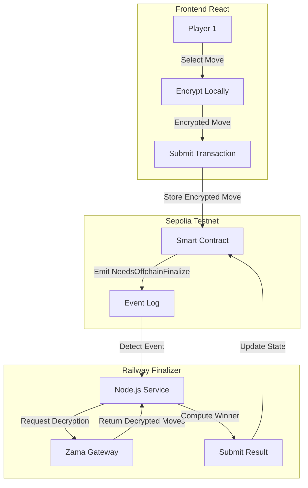

# Rock Paper Scissors with Fully Homomorphic Encryption

## Overview
A decentralized Rock Paper Scissors game using **Zama's FHEVM** for true privacy-preserving gameplay on Sepolia testnet. Players submit encrypted moves that remain private until an off-chain finalizer decrypts them to determine the winner.

## Table of Contents

1. [Features](#features)
2. [Privacy & Architecture](#privacy--architecture)
3. [Prerequisites](#prerequisites)
4. [Quick Start](#quick-start)
5. [Deployment](#deployment)
6. [Smart Contract Details](#smart-contract-details)
7. [Troubleshooting](#troubleshooting)

## Features

- **True FHE Encryption**: Uses Zama's FHEVM SDK (`@zama-fhe/relayer-sdk` v0.3.0-6) for real Fully Homomorphic Encryption
- **Web3 Wallet Integration**: WalletConnect support for MetaMask and mobile wallets
- **Private Moves**: Moves encrypted client-side and remain private until finalization
- **Automated Finalization**: Backend service automatically decrypts and finalizes games
- **Modern UI**: React + Tailwind CSS + shadcn/ui

## Privacy & Architecture

### How FHE Ensures Privacy
Unlike traditional "commit-reveal" schemes where players must manually reveal their moves, this game uses **Fully Homomorphic Encryption (FHE)** to ensure privacy without extra user steps.

1. **Client-Side Encryption**: Your move (Rock/Paper/Scissors) is encrypted locally in your browser using Zama's SDK.
2. **Encrypted Submission**: The *encrypted* move is sent to the smart contract. The contract *never* sees the raw move.
3. **Private Storage**: The contract stores the encrypted moves. Even blockchain validators cannot see your choice.
4. **Secure Decryption**: Only the authorized finalizer (using the Zama Gateway) can decrypt the moves to determine the winner.

### System Architecture



### Encryption Flow
```
User Input: Rock (0)
   ↓
FHE Encryption: Zama euint8 ciphertext
   ↓
Smart Contract: Stores ciphertext (e.g. 0x123...)
   ↓
Finalizer: Detects event, requests decryption via Gateway
   ↓
Decryption: Returns 0 (Rock)
   ↓
Logic: Rock vs Scissors -> Rock Wins
```

## Prerequisites

- **Node.js**: v18.x or higher
- **pnpm**: `npm install -g pnpm`
- **Git**
- **MetaMask** or WalletConnect-compatible wallet
- **Sepolia ETH** for gas fees

## Quick Start

### 1. Clone and Install

```bash
git clone https://github.com/ismailkonvah/rps.git
cd rps
pnpm install
```

### 2. Configure Frontend

Create `.env` in project root:

```env
VITE_CONTRACT_ADDRESS=0x004510a8a91D7AedAd6eeB58C6D3c40Dc9578667
VITE_RPC_URL=https://eth-sepolia.g.alchemy.com/v2/YOUR_KEY
```

Get a WalletConnect Project ID from [WalletConnect Cloud](https://cloud.walletconnect.com/) and update `src/config/wagmi.js`:

```javascript
const projectId = 'YOUR_PROJECT_ID'
```

### 3. Run Frontend

```bash
pnpm run dev
```

Visit `http://localhost:5173` and connect your wallet.

## Deployment

### Smart Contract (Already Deployed)

Contract Address: `0x004510a8a91D7AedAd6eeB58C6D3c40Dc9578667` (Sepolia)

To deploy your own:

```bash
cd backend
npm install
npx hardhat run scripts/deploy.js --network sepolia
```

### Backend Finalizer (Railway)

The finalizer must run on a platform that supports long-running processes (Railway, Render, Fly.io, etc.).

**Railway Deployment:**

1. Go to [railway.app](https://railway.app) and sign in with GitHub
2. Create New Project → Deploy from GitHub → Select `ismailkonvah/rps`
3. **Settings** → Set Root Directory to `backend`
4. **Variables** → Add:
   ```
   RPC_URL=https://eth-sepolia.g.alchemy.com/v2/YOUR_KEY
   ADMIN_PRIVATE_KEY=0x...
   CONTRACT_ADDRESS=0x004510a8a91D7AedAd6eeB58C6D3c40Dc9578667
   ```
5. Deploy!

## Smart Contract Details

**Contract Address**: `0x004510a8a91D7AedAd6eeB58C6D3c40Dc9578667`
**Network**: Sepolia Testnet

### Key Functions

```solidity
// Create a new game
function createGame(uint256 wager) external payable returns (uint256)

// Join an existing game
function joinGame(uint256 gameId) external payable

// Submit encrypted move
function submitMove(uint256 gameId, bytes calldata encryptedMove) external

// Finalize game (Admin only)
function finalizeResult(uint256 gameId, uint8 winner) external
```

## Troubleshooting

### Frontend Issues

**"FHEVM not ready yet"**
- Wait a few seconds for FHEVM initialization
- Check browser console for errors
- Ensure you're on Sepolia network

**WalletConnect not working**
- Verify `projectId` in `src/config/wagmi.js`
- Check wallet is on Sepolia network
- Clear browser cache and reconnect

### Backend Issues

**Finalizer not detecting games**
- Check Railway logs for "Listening for events"
- Verify environment variables are set
- Ensure admin wallet has Sepolia ETH

**Decryption failed**
- Check Railway logs for specific error
- Verify SDK version is `0.3.0-6`
- Ensure contract address is correct

## Tech Stack

- **Frontend**: React, Vite, Tailwind CSS, shadcn/ui
- **Web3**: wagmi, viem, ethers.js v6, WalletConnect
- **FHE**: Zama FHEVM SDK v0.3.0-6
- **Smart Contract**: Solidity, Hardhat
- **Backend**: Node.js, ethers.js
- **Deployment**: Vercel (frontend), Railway (finalizer)

## Live Demo

**Frontend**: https://rps-ebon-gamma.vercel.app  
**Contract**: [0x004510a8a91D7AedAd6eeB58C6D3c40Dc9578667](https://sepolia.etherscan.io/address/0x004510a8a91D7AedAd6eeB58C6D3c40Dc9578667)

## License

MIT

## Contributing

Pull requests welcome! Please open an issue first to discuss proposed changes.

---

Built with ❤️ using Zama FHEVM
